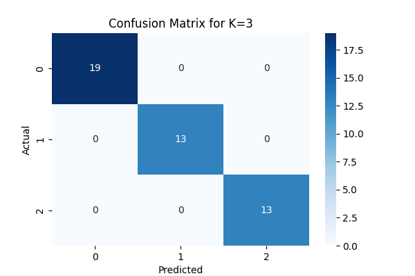

# Iris Classification using K-Nearest Neighbors (KNN)

This project applies the **K-Nearest Neighbors (KNN)** algorithm to classify species in the well-known **Iris dataset**.  
It covers data preprocessing, training, evaluation, and graphical representation of results.  
Developed by **Puchalapalli Eeswari Devi** for AI & ML Internship **Task 6**.

## 📌 Features
- Load and analyze the Iris dataset.
- Apply feature normalization for improved accuracy.
- Split dataset into training and testing sets.
- Experiment with different values of K and record accuracy.
- Evaluate results using:
  - Accuracy score
  - Confusion matrix
  - Classification report
- Visualize decision boundaries and model predictions.

## 🛠️ Technologies Used
- Python 3.x
- scikit-learn
- pandas
- numpy
- matplotlib
- seaborn

## 🚀 How to Run
1. Clone this repository:
   ```bash
   git clone https://github.com/<your-username>/iris-knn-model-puchalapallieeswaridevi.git
   cd iris-knn-model-puchalapallieeswaridevi
2.Install the required dependencies:

 ```bash
    pip install -r requirements.txt
```
3.Run the project:
```bash
   python knn_classification.py
```


## 📸 Project Screenshot




✨ Happy learning and coding, Eeswari Devi! 🚀🌸


